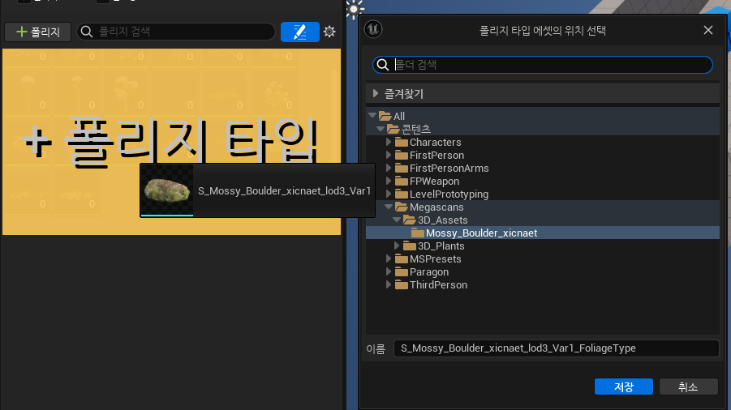
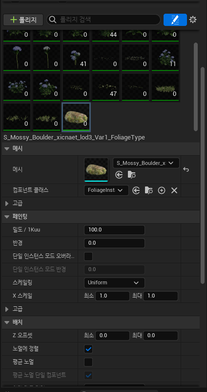
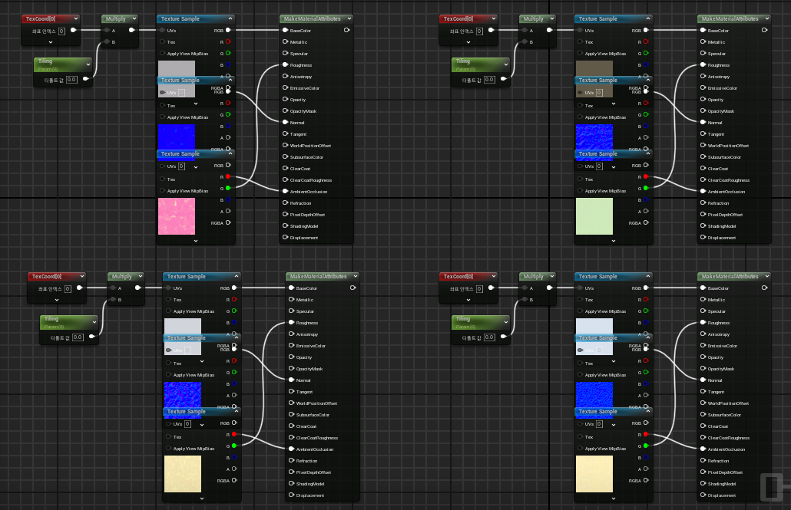

<aside>
📖

</aside>

문서에 이미지, Gif가 많아 로딩이 오래 걸릴 수 있습니다. 

## 퀵셀 브리지

### 퀵셀 브리지란?

실제 물체를 스캔해서 만든 3D 모델, 2D 텍스처 데이터들을 라이브러리로 정리하고 툴 및 엔진 등에 내보내기 기능을 지원하는 프로그램입니다. 언리얼 계정으로 로그인하면 무료로 사용할 수 있고, 언리얼 프로젝트에 바로 추가할 수 있습니다.

언리얼 5에서는 엔진에 기본으로 설치되어 에디터를 통해 바로 접근할 수 있는 것 같습니다.

### 퀵셀 브리지 사용하기

1. 콘텐츠 브라우저에서 열기

2. 메인 화면에서 열기

두 가지 방법 중 하나를 선택해서 브리지를 열면 아래와 같은 창이 열리는데, 우측의 아이콘을 눌러 로그인합니다.

---

로그인 한 뒤에는 좌측의 목록에서 필요한 애셋을 찾습니다.

---

### 애셋 다운로드 방법 1. 설정 후 다운로드 및 내보내기

애셋을 클릭하면 우측에 간단한 정보 창이 나타납니다.

1. 애셋의 퀄리티를 설정합니다. 
(퀄리티에 따라 용량 및 디테일의 차이가 있습니다.. 아마도..)
2. 메가스캔 관련 설정입니다. 
(정확히 어떤 설정인지 잘 모르겠습니다..)
3. 애셋을 다운로드 합니다.
4. 애셋을 프로젝트로 내보냅니다.

---

### 애셋 다운로드 방법 2. 빠른 다운로드 및 내보내기

원하는 애셋에 마우스를 올리고, 우측 상단의 아이콘을 눌러 즉시 다운로드 할 수 있습니다.

다운로드가 완료되면 좌측 상단에 체크 표시가 나타나고, 우측 상단의 파란 화살표 아이콘을 클릭하면 프로젝트에 애셋이 추가됩니다.

---

애셋이 추가되면 콘텐츠 브라우저에 해당 애셋의 폴더가 나타납니다.

---

### 퀵셀 브리지 애셋 저장 경로 변경하기

애셋은 기본적으로 문서\Megascans Library 폴더에 저장됩니다.

우측 아이콘의 Preferences 메뉴에서 다운로드 받을 애셋의 저장 위치를 설정할 수 있습니다.

## 폴리지

### 폴리지로 다양한 스태틱 메시 한번에 설치하기

좌측 상단에서 폴리지 모드로 변경합니다.

폴리지가 있는 애셋을 추가했다면, 좌측 화면에 폴리지가 추가된 것을 확인할 수 있습니다.

만약 폴리지가 없거나, 폴리지가 있어도 추가되지 않았다면 스태틱 메시를 드래그&드롭 하여 폴리지를 만들고 추가할 수 있습니다.

설치할 메시를 선택하고 클릭|드래그를 통해 한번에 메시를 설치할 수 있습니다.

shift + 클릭|드래그를 통해 설치한 메시를 지울 수 있습니다.

### 폴리시로 설치할 메시 개별 설정하기

메시를 선택하면 아래에 메시의 정보가 표시됩니다. 여기서 각 메시의 세부 설정을 할 수 있습니다.

밀도 : 설치되는 메시의 수

반경 : 설치되는 메시 간의 거리

X스케일 : 메시의 최소~최대 크기

Z오프셋 : 메시의 최소~최대 높이

### 설치한 잔디 폴리지에 바람에 흔들리는 효과 적용하기

아래와 같은 순서로 스태틱 메시→머티리얼→Wind 효과를 활성화 합니다.

EnableGrassWind 위의 4가지 설정으로 바람의 세부 사항을 설정할 수도 있습니다.

### 설치한 폴리지 위에 메시를 설치하기

먼저 최상단의 페인트 설정에서 폴리지 항목을 활성화합니다.

해당 항목을 활성화해도 스태틱 메시에 콜리전이 설정되어 있지 않다면 폴리지 위에 설치되지 않습니다. 이런 경우에는 콜리전을 설정해줘야 합니다.

먼저, 스태틱 메시에 콜리전이 없다면, 아래와 같은 순서로 스태틱 메시에 콜리전을 생성합니다.

이어서, 폴리지 창에서 메시의 콜리전 프리셋을 BlockAll로 설정해줍니다.

이후 폴리지를 설치하면, 설치된 폴리지 위에 다른 폴리지를 설치할 수 있습니다.

## 랜드스케이프

### 지형 만들기

좌측 상단에서 모드를 랜드스케이프 모드로 변경합니다.

랜드스케이프를 원하는 크기로 설정한 뒤 생성합니다. 이 때, 레이어 시스템 활성화가 되어있는지 확인합니다.

이후, 스컬프팅 메뉴를 활용해 지형을 제작합니다. 스컬프팅 메뉴는 직접 사용해보는 것이 이해가 빠를 것 같아, 설명은 생략하겠습니다.

### 텍스처를 섞어 지형에 페인팅하기

이 내용은 아래의 링크 내용을 참고해서 진행했습니다.

https://dev.epicgames.com/community/learning/tutorials/pPm6/unreal-engine-a292e2

페인팅에 사용할 텍스처를 퀵셀 브리지에서 다운로드 했습니다.

먼저 페인팅에 사용할 머티리얼을 생성합니다.

생성한 머티리얼에 텍스처들을 가져옵니다.

MakeMaterialAttributes 노드를 생성해 텍스처를 연결합니다.

텍스처가 타일링 되는 것을 방지하기 위해 TextureCoordinate, Multiply, Constant 노드를 생성해 연결합니다. 상수 노드는 파라미터로 변환하고, Tiling으로 이름을 지정합니다.

텍스처가 너무 많아지면 적용이 안되는 경우가 있는데, 그 때는 텍스처를 선택하고 샘플러 소스를 Shared:Wrap 으로 변경합니다.

같은 방식으로 다른 텍스처들도 연결해줍니다.

LandscapeLayerBlend 노드를 추가하고, 사용할 텍스처 개수만큼 인덱스를 추가한 뒤, 각 노드를 연결합니다.

연결한 레이어의 이름을 설정합니다.

머티리얼 노드의 머티리얼 어트리뷰트 설정을 활성화하고, 이전에 만든 LandscapeLayerBlend 노드를 연결하고 저장합니다.

제작한 머티리얼의 인스턴스를 생성하고, 랜드스케이프에 머티리얼 인스턴스를 설정합니다.

랜드스케이프→페인트→레이어 에서 각 레이어에 웨이트를 생성 및 설정해줍니다.

이후, 페인팅을 하면 단색으로 나오는 것을 확인할 수 있는데, 머티리얼 인스턴스의 Tiling 값을 조정해줍니다.

