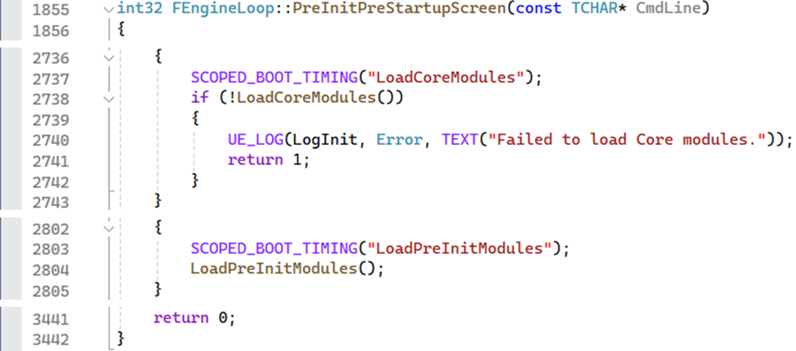

## 부제 - Actor의 생성자, PostInitializeComponents(), BeginPlay()의 호출 시점

### 요약

1. **Actor의 생성자**는 엔진 초기화 이전에, FEngineLoop::PreInit()에서 모듈이 로드될 때 호출된다. 따라서, 생성자에는 게임 플레이와 관련된 코드는 포함하면 안된다.
→생성자 호출이 끝난 뒤에 바로 InitProperties(), PostInitProperties()가 호출된다.
2. **PostInitializeComponents()**는 맵 패키지의 로드가 끝난 뒤에 호출된다.
3. **BeginPlay()**는 게임을 시작하기 위한 모든 준비가 끝났을 때 호출된다.

## 전개

엔진 버전 : 5.3.2

엔진이 어떻게 시작 되는지 궁금해서 찾아봤는데, 너무 먼 길을 와버렸다.
내용이 너무 많아서 다 설명하기엔 시간이 부족하기 때문에, 파트 4_2강에서 사용한 생성자, PostInitializeComponent(), BeginPlay() 세 함수의 호출 시점을 찾아보는 것으로 주제를 정하고, 요약했다.
그 외에 찾아본 내용은 토글을 활용해 접어서 기록해 두기로 했다.

**GuardedMain()**

- Main() 이전
    
    F11로 시작하면 처음 걸리는 위치 - 윈도우 환경이라서 여기서 시작한다.    
        
    Source\Runtime\Launch\Private\Windows\LaunchWindows.cpp
    
    해당 함수 안에 있는 GuardedMain이 진짜 시작이라고 보면 된다.    
    
    

GuardedMain()을 보면 기본적인 루프를 확인할 수 있다.
시작부터, BeginPlay()까지 알아볼 것이기 때문에, EnginePreInit(), EngineInit()만 들어갔다.
전체 흐름만 볼 수 있도록 하고, 아래에 EnginePreInit() 과 EngintInit() 에서 수행되는 과정을 간단하게 정리했다.

Source\Runtime\Launch\Private\Launch.cpp

- EditorInit() 과 EnginInit()의 차이 (별거 없다)
    
    EditorInit()을 타고 들어가보면, UnrealEd.Globals.cpp로 가지만, 그 안에서 EngineLoop.Init()을 호출해 결국 FEngineLoop::Init()으로 간다    
        
    Source\Editor\UnrealED\Private\UnrealEdGlobals.cpp
    
    
    Source\Runtime\Launch\Private\Launch.cpp
    

[PreInit()에서는 low-level 엔진 모듈을 로드해서 필수 시스템이 초기화되고 필수 유형이 정의된다.](https://youtu.be/IaU2Hue-ApI?si=N7oco_i8u7q4P1Na&t=219)

EnginePreInit()에서 로드하는 모듈은 아래와 같다.

- 생성자 호출 시점을 확인한 과정
    
    흐름을 따라가면서 LoadPreInitModules() 에서 Engine 모듈을 로드할 때 Actor의 생성자가 호출되는 것으로 추측했다. (Actor.cpp가 Engine\Private 안에 있으니까)
    
    파트 1_5 강에서 생성자에 디버그를 걸었을 때 에디터 로딩 75%에서 걸린다는 것이 떠올랐고, 디버깅으로 위치를 확인해봤다.    
    
    
    PreInit() 안이긴 한데, 추측한 LoadPreInitModules()가 아니라 그 이후에 호출되는 LoadStartupModules()에서 호출됐다. 직접 만든 액터는 시스템에 필수적인 요소는 아니라서 필수 요소가 갖춰진 뒤에 호출되는 것 같다.
    
    어쨌든 이 시점에는 게임 플레이를 위한 준비는 되어있지 않은 상태이기 때문에, 생성자에는 게임 플레이 관련 코드를 포함하면 안되는 이유는 확인할 수 있었다.
    

다음으로 EngintInit()에서는 엔진을 생성, 초기화하고, 프로젝트와 플러그인 모듈을 로드하고 엔진을 시작한다.

**GEngine→Init()** 에서는 엔진을 초기화하고, GameInstance, GameViewportClient, LocalPlayer 등을 생성 및 초기화한다.
**GEngine→Start()** 에서는 **LoadMap()** 을 통해 World, GameMode, GameState, PlayerController 등이 생성 및 초기화되어 게임을 시작할 준비를 마치고, **BeginPlay()** 를 호출한다.

**LoadMap()** 안에서 **BeginPlay()** 뿐 아니라 **PostInitializeComponents()** 도 호출된다.

아래 그림에서 ENGINE OBJECTS 파트를 **GEngine→Init()** 가, GAME OBJECTS 파트를 **GEngine→Start()** 가 생성한다.

</aside>

### FEngineLoop::PreInit() 내부

표시된 두 함수를 타고 들어가 봤다.

Source\Runtime\Launch\Private\LaunchEngineLoop.cpp

먼저 PreInitPreStartupScreen() 에서는 [위에서 확인한 그림](https://www.notion.so/BeginPlay-dde211ce76704302b62e1c7fd29c3669?pvs=21)의 **LoadCoreModules()**, **LoadPreInitModules()** 를 호출하는 것을 확인했다.

다음으로 PreInitPostStartupScreen() 에서는 [위에서 확인한 그림](https://www.notion.so/BeginPlay-dde211ce76704302b62e1c7fd29c3669?pvs=21)의 **LoadStartupCoreModules()** 를 호출한다.

**LoadStartUpCoreModules()** 내부로 들어가보면 Core 모듈을 로드하는 것을 확인할 수 있다.

$\footnotesize\color{666666}{아래는~PreInitPreStartupScreen()~함수~내부의~코드}$

이 외에도 게임 이름을 설정하거나, 

셰이더 코드 라이브러리를 준비하거나,

게임 스레드를 준비하거나,

난수 생성을 위한 준비하는 모습도 확인할 수 있었다.

### FEngineLoop::Init() 내부

UGameEngine의 Init()을 들어가 봤다.

- **GEngine→Init()**
    
    **GameInstance, GameViewportClient, LocalPlayer** 생성 및 초기화를 확인할 수 있다.    
    
    
    추가로 UEngine::Init() 을 들어가보면 플러그인 관련된 코드를 확인할 수 있는데,    
    
    
    .uplugin 파일을 열면 유사한 내용을 확인할 수 있다.    
    
    

GEngine→Init() 이후에는 프로젝트와 플러그인 모듈을 로드한다.

그리고 GEngine→Start() 가 호출된다.

- **GEngine→Start()**
    
    **Start()→StartGameInstance()→Browse()→LoadMap()** 으로 들어갔다.    
    

    **LoadMap()** 에서 먼저 전역 Delegate로 맵이 변경됨을 알리고, 현재 맵을 언로드한다.    
    
    
    현재 맵을 닫는 작업이 끝나면, 새 맵을 로드한다.    
    
    
    .umap 파일에 월드, 레벨, 액터, 컴포넌트가 직렬화되어 저장되는데, 이 파일을 로드하는 것이다. (파트 1_13강에서 직렬화에 대해 설명한다.)    
        
    
    
    이렇게 파일을 로드하고 나면, 새 맵을 현재 맵으로 등록한다. 이후 InitWorld() 를 수행한다.    
    
    
    InitWorld() 에서는 물리, 네비게이션, AI, 오디오 등의 시스템을 초기화한다.    
    
    
    이어서 SetGameMode()를 호출한다. SetGameMode() 에서 GameMode 액터가 생성된다.    
    
    
    GameMode를 생성하고, 맵을 완전히 로드한다.
    
    
    다음으로, InitializeActorsForPlay() 를 호출해 액터 초기화 작업을 시작한다.
    
    
    InitializeActorsForPlay() 에서는 먼저 UpdateWorldComponents() 로 액터의 컴포넌트들을 월드에 등록한다.
    
    
    이후, GameMode→InitGame()에서 GameSession 액터를 생성한다.
    
    
    이어서 레벨마다 루프를 돌면서 각 레벨의 액터를 초기화한다.
    
    
    여기서 PreInitializeComponents(), InitializeComponents(), PostInitializeComponents() 가 호출되는 것을 확인할 수 있다. $\sixptsize\color{666666}{드디어!!}$

    이 과정에서 GameMode의 PreInitializeComponents() 또한 호출되고, 그 안에서 GameState가 생성 및 초기화된다.    
    
    
    이로써 월드가 완전히 초기화되고 게임 프레임워크가 생성됐다.
    다음은 플레이어 관련 작업이 진행되는데,,,,, $\sixptsize\color{666666}{이~부분은~체력과~정신력의~문제로~더~파고들지~못했다...}$
    
    
    플레이어 작업까지 진행되고 나면 비로소 **BeginPlay()** 와 마주하게 된다.    
    
    
    World는 GameMode에게 → GameMode는 GameState에게 → GameState는 모든 Actor에게 BeginPlay를 알리고, LoadMap() 의 처리가 끝나 GameLoop에 포함된다.
    
    
    $\sixptsize\color{666666}{정말~힘들었다..~그래도~오랜~시간을~들인~만큼~흐름~자체는~제대로~파악한~듯~하다..}$

~~잠을 안자고 장시간 작성한 글이라서 형식이 고르지 못한 점 양해 부탁 드립니다.~~  ~~😂😂~~

**내용 관련해서 피드백 또는 질문은 환영합니다. 가독성이 좋지 못해 수정했으면 하는 부분이나, 자세한 설명이 필요하시면 언제든 말씀해주세요!**