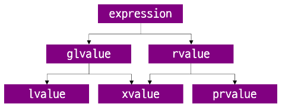
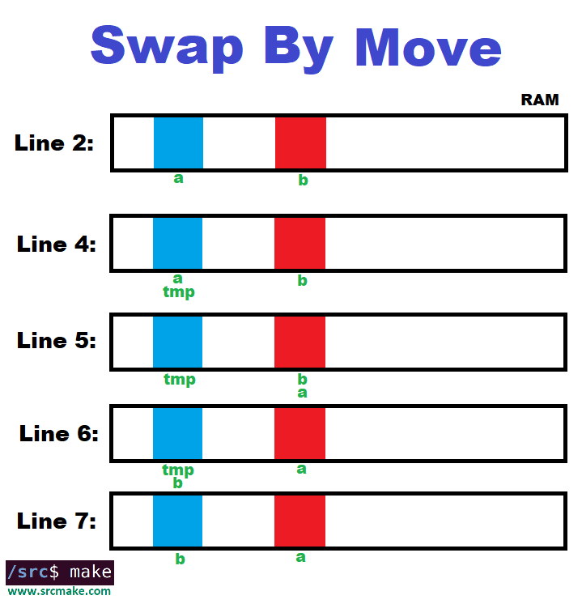
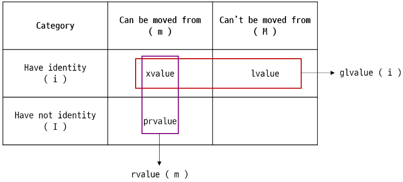
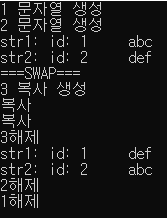
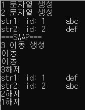
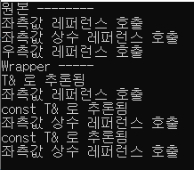
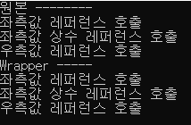
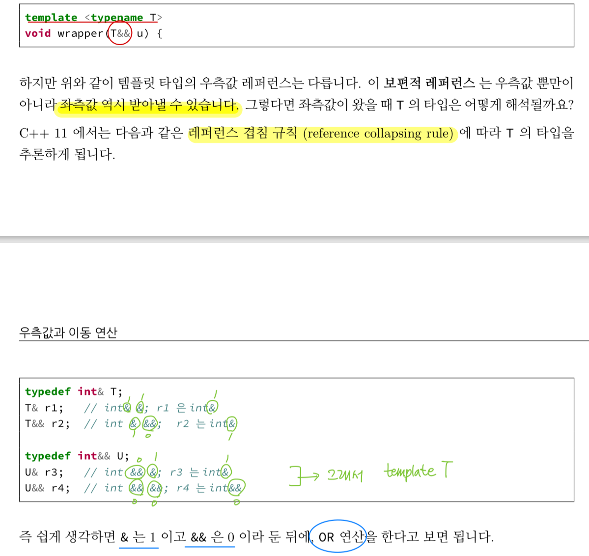

## 퀴즈

- f 함수를 어떻게 짜야 컴파일 오류가 나지 않을까?

```cpp
#include <iostream>
using namespace std;
int main()
{
	f() = 1;
	cout << f() << endl;

	int j = 2;
	f(j) = 3;
	cout << j << endl;

	return 0;
}
```

- 정답
    
    ```cpp
    int a;
    int& f() {
    	return a;
    }
    int& f(int _a) {
    	a = _a;
    	return a;
    }
    ```
    

## 좌측값과 우측값 쉬운 이해

https://en.cppreference.com/w/cpp/language/value_category

- 좌측값은 대입 연산자 ‘=’ 의 좌측에 올 수도, 우측에 올 수도 있다.
- 좌측값은 glvalue로 생각하면 된다.
    
    ```cpp
    void foo();
     
    void baz()
    {
        int a; // Expression `a` is lvalue
        a = 4; // OK, could appear on the left-hand side of an assignment expression
     
        int &b{a}; // Expression `b` is lvalue
        b = 5; // OK, could appear on the left-hand side of an assignment expression
     
        const int &c{a}; // Expression `c` is lvalue
        c = 6;           // ill-formed, assignment of read-only reference
    }
    ```
    
- 우측값은 대입 연산자 ‘=’ 의 우측에만 올 수 있는 값이다.
- 우측값은 prvalue로 생각하면 된다.

## Value 종류

- lvalue : `identity`를 가지면서 `move`될 수 없는 표현식들
- xvalue : `identity`를 가지면서 `move`될 수 있는 표현식들
- prvalue : `identity`를 가지고 있지 않으면서 `move`될 수 있는 표현식들
- glvalue : `identity`를 가지고 있는 표현식들 (lvalue, xvlaue모두 glvalue 표현식)
- rvalue : `move`될 수 있는 표현식들 (prvalue, xvalue 모두 rvalue 표현식)
- `identity`를 가지고 있지 않으면서 `move`될 수 없는 것들
- [참고 링크 1번](https://www.notion.so/b4b2970c274d45dab1aeeb32605eaa7d?pvs=21) - **C++ Values(lvalue, rvalue, xvalue, prvalue, glvalue)**
    
    
    
- ‘`move` 될 수 있다’의 기준: 값이 **메모리**에서 **이동**될 수  있다.
    
    
    
    - move를 한다는 것은 '메모리 공간을 움직이는 것'이 아니라 '메모리 공간의 이름을 바꾸는 것'이라는 것이다.
    - 출처: https://velog.io/@15ywt/c-rvalue-reference
- ‘`identity` 가진다’의 의미 :
    - What does it mean for a value to have identity? If you have (or you can take) the memory address of a value, and use it safely, then the value has identity
    - 출처: https://learn.microsoft.com/en-us/windows/uwp/cpp-and-winrt-apis/cpp-value-categories#an-lvalue-has-identity

### LValue

```cpp
#include <iostream>
static int a = 10; // [참고 링크 2번](https://mr-dingo.github.io/c/c++%EB%BD%80%EA%B0%9C%EA%B8%B0/2019/01/10/static&extern.html) - 전역 변수의 static 의미와 extern
int& foo() {
    a++;
    return a;
}
int foo2(){
    return a;
}

// 좌측값 (Lvalue)
int main(){
    int a = 10, b = 10, c = 10;
    int *j = &a; // 메모리 주소를 참조 가능하기 때문에 a는 좌측값(Lvalue)
    std::cout << "*j = " << *j << "\n"; // 10
    
    foo() = 43; // foo()는 좌측값(Lvalue)
    std::cout << "foo() = " << foo() << "\n"; // 44
    
    int *ptr1 = &foo(); // &foo()가능하기 때문에 좌측값(Lvalue)
    std::cout << "*ptr1 = " << *ptr1 << ""; // 45
    
    ++a; // a는 lvalue, pre-increasement, pre-decreasement
    std::cout << "a = " << a << "\n"; // 11
    
    int cc[4];
    std::cout << "cc[1] = " << cc[1] << "\n"; // c[1]도 lvalue // 0
    a ? b : c; // a ? b : c 의 반환값은 b 또는 c이므로 lvalue
}
```

특징

- 대입문의 좌측에 올 수 있다.
- &연산자로 값의 주소를 얻어올 수 있다.
- 표현식이 끝나더라도 값이 살아있다.

### XValue

```cpp
int a = 0; // a는 lvalue, 0은 prvalue
int&& c = std::move(a); // std::move(a)는 xvalue, c는 lvalue
```



`identity`를 가지면서 `move`될 수 있는 표현식들을 xvalue라고 한다. eXpiring에서 따와 xvalue라고 부른다. xvalue는 말 그대로 만료되어가는 값을 뜻한다. 그래서 표현식이 끝나고 표현식이 의미하던 주소로 접근했을 때 값이 존재할 수도 있고, 존재하지 않을 수도 있다. 위의 그림 처럼 이동될 수 있지만, 메모리에 올라가는 순간 주소를 갖게 되므로 prvalue는 될 수 없다. 컴파일러는 이러한 prvalue의 임시데이터를 저장할 공간이 필요한데, 이러한 임시 데이터 객체를 xvalue라고 한다. 예를 들어 `std::move(x)`와 같이 rvalue reference를 리턴할 수 있는 함수는 lvalue를 move하고, move한 값은 xvalue에 속하게 된다.

특징

- 컴파일러만 사용하는 객체 이기 때문에 &연산자가 허용되지 않는다.
- 표현식이 끝났을 때 사라진다.

### PRValue

```cpp
int a = 10;
int b = 20;
a++;
a+b;
if(a < b) { // a < b의 결과값 bool은 prvalue

}
```

prvalue는 `pure rvalue`의 약자로 후위 증감연산자, 문자열 리터럴을 제외한 모든 리터럴 등이 prvalue에 속한다. prvalue는 대입문 오른쪽에 올 수 있으며 주소가 없다는 특징을 가지고 있다.

특징

- 대입문의 우측에 올 수 있다.
- 주소가 없다.

### 매개변수 const type &

- 매개변수 `const type &` 은 좌측값과 우측값을 모두 받을 수 있다.
- `const type *` 초기화할 때 좌측값과 우측값을 모두 받을 수 있는 것과 마찬가지이다.

### 우측값 레퍼런스 &&

- 우측값만을 받는 것이다.
- 이동 생성자에 사용하기 위해 만들어진 타입이다.

## 이동 생성자

- swap에서 불필요한 복사가 일어나는 경우
    
    ```cpp
    #include <stdlib.h>
    #include <iostream>
    #include <vector>
    using namespace std;
    
    class MyString
    {
    	int id;
    	int size;
    	int length;
    	char* data;
    public:
    	static int cnt;
    	MyString() : size(0), length(0), data(nullptr), id(++cnt) { cout << "빈 문자열 생성\n"; }
    	MyString(const char* str)
    	{
    		id = ++cnt;
    		cout << id << " 문자열 생성\n";
    		size = length = strlen(str);
    		data = new char[length];
    		for (int i = 0; i < length; ++i)
    		{
    			data[i] = str[i];
    		}
    	}
    	MyString(const MyString& str)
    	{
    		id = ++cnt;
    		cout << id << " 복사 생성\n";
    		size = str.size;
    		length = str.length;
    		if (size < length)
    		{
    			size = length;
    		}
    		data = new char[size];
    		for (int i = 0; i < length; ++i)
    		{
    			data[i] = str.data[i];
    		}
    	}
    	MyString(MyString&& ref) noexcept
    	{
    		id = ++cnt;
    		cout << id << " 이동 생성\n";
    		size = ref.size;
    		length = ref.length;
    		if (size < length)
    		{
    			size = length;
    		}
    		data = ref.data;
    		ref.length = 0;
    		ref.size = 0;
    		ref.data = nullptr;
    	}
    	~MyString()
    	{
    		cout << id << "해제\n";
    		--cnt;
    		if (data)
    		{
    			delete[] data;
    		}
    	}
    	MyString& operator=(const MyString& str)
    	{
    		cout << "복사\n";
    		if (size < str.length)
    		{
    			delete[] data;
    			size = str.length;
    			data = new char[size];
    		}
    		length = str.length;
    		for (int i = 0; i < length; ++i)
    		{
    			data[i] = str.data[i];
    		}
    		return (*this);
    	}
    	MyString& operator=(MyString&& str) noexcept
    	{
    		cout << "이동\n";
    		delete[] data;
    		size = str.size;
    		length = str.length;
    		if (size < length)
    		{
    			size = length;
    		}
    		data = str.data;
    		str.data = nullptr;
    		return (*this);
    	}
    	int Length() const
    	{
    		return length;
    	}
    	void Print() const
    	{
    		cout << "id: " << id << '\t';
    		for (int i = 0; i < length; ++i)
    		{
    			cout << data[i];
    		}
    		cout << "\n";
    	}
    };
    int MyString::cnt = 0;
    
    template <typename T>
    void MySwap(T& a, T& b)
    {
    	T tmp(a);
    	a = b;
    	b = tmp;
    }
    
    int main(void)
    {
    	MyString str1("abc");
    	MyString str2("def");
    	cout << "str1: ";
    	str1.Print();
    	cout << "str2: ";
    	str2.Print();
    	cout << "===SWAP===\n";
    	MySwap(str1, str2);
    	cout << "str1: ";
    	str1.Print();
    	cout << "str2: ";
    	str2.Print();
    }
    ```
    
    
    
- swap에서 move()함수를 이용해 복사를 이동으로 고치기
    
    ```cpp
    #include <stdlib.h>
    #include <iostream>
    #include <vector>
    using namespace std;
    
    class MyString
    {
    	int id;
    	int size;
    	int length;
    	char* data;
    public:
    	static int cnt;
    	MyString() : size(0), length(0), data(nullptr), id(++cnt) { cout << "빈 문자열 생성\n"; }
    	MyString(const char* str)
    	{
    		id = ++cnt;
    		cout << id << " 문자열 생성\n";
    		size = length = strlen(str);
    		data = new char[length];
    		for (int i = 0; i < length; ++i)
    		{
    			data[i] = str[i];
    		}
    	}
    	MyString(const MyString& str)
    	{
    		id = ++cnt;
    		cout << id << " 복사 생성\n";
    		size = str.size;
    		length = str.length;
    		if (size < length)
    		{
    			size = length;
    		}
    		data = new char[size];
    		for (int i = 0; i < length; ++i)
    		{
    			data[i] = str.data[i];
    		}
    	}
    	MyString(MyString&& ref) noexcept
    	{
    		id = ++cnt;
    		cout << id << " 이동 생성\n";
    		size = ref.size;
    		length = ref.length;
    		if (size < length)
    		{
    			size = length;
    		}
    		data = ref.data;
    		ref.length = 0;
    		ref.size = 0;
    		ref.data = nullptr;
    	}
    	~MyString()
    	{
    		cout << id << "해제\n";
    		--cnt;
    		if (data)
    		{
    			delete[] data;
    		}
    	}
    	MyString& operator=(const MyString& str)
    	{
    		cout << "복사\n";
    		if (size < str.length)
    		{
    			delete[] data;
    			size = str.length;
    			data = new char[size];
    		}
    		length = str.length;
    		for (int i = 0; i < length; ++i)
    		{
    			data[i] = str.data[i];
    		}
    		return (*this);
    	}
    	MyString& operator=(MyString&& str) noexcept
    	{
    		cout << "이동\n";
    		delete[] data;
    		size = str.size;
    		length = str.length;
    		if (size < length)
    		{
    			size = length;
    		}
    		data = str.data;
    		str.data = nullptr;
    		return (*this);
    	}
    	int Length() const
    	{
    		return length;
    	}
    	void Print() const
    	{
    		cout << "id: " << id << '\t';
    		for (int i = 0; i < length; ++i)
    		{
    			cout << data[i];
    		}
    		cout << "\n";
    	}
    };
    int MyString::cnt = 0;
    
    template <typename T>
    void MySwap(T& a, T& b)
    {
    	T tmp(move(a));
    	a = move(b);
    	b = move(tmp);
    }
    
    int main(void)
    {
    	MyString str1("abc");
    	MyString str2("def");
    	cout << "str1: ";
    	str1.Print();
    	cout << "str2: ";
    	str2.Print();
    	cout << "===SWAP===\n";
    	MySwap(str1, str2);
    	cout << "str1: ";
    	str1.Print();
    	cout << "str2: ";
    	str2.Print();
    }
    ```
    
    
    

## 보편적 레퍼런스

- 보편적 레퍼런스가 필요한 이유
    
    ```cpp
    #include <iostream>
    #include <vector>
    
    template <typename T>
    void wrapper(T& u) {
      std::cout << "T& 로 추론됨" << std::endl;
      g(u);
    }
    
    template <typename T>
    void wrapper(const T& u) {
      std::cout << "const T& 로 추론됨" << std::endl;
      g(u);
    }
    
    class A {};
    
    void g(A& a) { std::cout << "좌측값 레퍼런스 호출" << std::endl; }
    void g(const A& a) { std::cout << "좌측값 상수 레퍼런스 호출" << std::endl; }
    void g(A&& a) { std::cout << "우측값 레퍼런스 호출" << std::endl; }
    
    int main() {
      A a;
      const A ca;
    
      std::cout << "원본 --------" << std::endl;
      g(a);
      g(ca);
      g(A());
    
      std::cout << "Wrapper -----" << std::endl;
      wrapper(a);
      wrapper(ca);
      wrapper(A());
    }
    ```
    
    - 실행 결과
        
        
        
- 보편적 레퍼런스와 `std::forward`를 사용했을 때
    
    ```cpp
    #include <iostream>
    
    template <typename T>
    void wrapper(T&& u) {
    	g(std::forward<T>(u));
    }
    
    class A {};
    
    void g(A& a) { std::cout << "좌측값 레퍼런스 호출" << std::endl; }
    void g(const A& a) { std::cout << "좌측값 상수 레퍼런스 호출" << std::endl; }
    void g(A&& a) { std::cout << "우측값 레퍼런스 호출" << std::endl; }
    
    int main() {
    	A a;
    	const A ca;
    
    	std::cout << "원본 --------" << std::endl;
    	g(a);
    	g(ca);
    	g(A());
    
    	std::cout << "Wrapper -----" << std::endl;
    	wrapper(a);
    	wrapper(ca);
    	wrapper(A());
    }
    ```
    
    - 실행 결과
        
        
        
- 보편적 레퍼런스 ≠ 우측값 레퍼런스
    - 보편적 레퍼런스는 좌측값도 받아낼 수 있다.
- 보편적 레퍼런스는 반드시 **템플릿 타입과 같이 사용**해야 한다.
- 레퍼런스 겹침 규칙에 따라 value 종류 추론
    
    
    
- 참고 - `std::forward` 레퍼런스 링크: https://en.cppreference.com/w/cpp/utility/forward
- `std::forward<T>(u)` 는 u가 우측값 레퍼런스 일 때에만 `move`를 적용해준다.
    
    ```cpp
    template <class T>
    T&& forward(typename std::remove_reference<T>::type& a) noexcept {
    	return static_cast<T&&>(a);
    }
    ```
    
    - T == A& 라면
        
        ```cpp
        A&&& forward(typename std::remove_reference<A&>::type& a) noexcept {
        	return static_cast<A&&&>(a);
        }
        
        A& forward(A& a) noexcept {
        	return static_cast<A&>(a);
        }
        ```
        
    - T == A 라면
        
        ```cpp
        A&& forward(A& a) noexcept {
        	return static_cast<A>(a);
        }
        ```
        
        - 여기서 왜 매개변수는 A& 일까?
        - `std::remove_reference<T>::type` 관련 레퍼런스 링크: https://en.cppreference.com/w/cpp/types/remove_reference
            
            ```cpp
            template<class T> struct remove_reference { typedef T type; };
            template<class T> struct remove_reference<T&> { typedef T type; };
            template<class T> struct remove_reference<T&&> { typedef T type; };
            ```
            
            그래서 매개변수가 T == A& 일때나 T == A 상관 없이 A&로 나온다.
            
        - [질문] 여기서 왜 리턴값이 static_cast<A&&>(a)가 아닐까?
            
            어차피 A&& (우측값 레퍼런스 반환) == A (우측값) 이어서 일까?
            

### 참고링크

1. **C++ Values(lvalue, rvalue, xvalue, prvalue, glvalue) :**  https://dydtjr1128.github.io/cpp/2019/06/10/Cpp-values.html
2. **전역 변수의 static 의미와 extern** : [https://mr-dingo.github.io/c/c++뽀개기/2019/01/10/static&extern.html](https://mr-dingo.github.io/c/c++%EB%BD%80%EA%B0%9C%EA%B8%B0/2019/01/10/static&extern.html)
3. 퀴즈 : https://waterbeetle.tistory.com/8