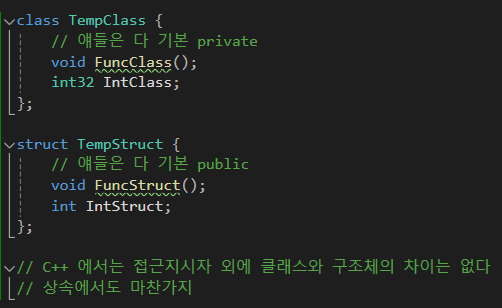
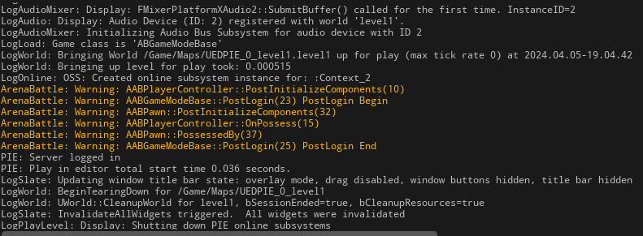
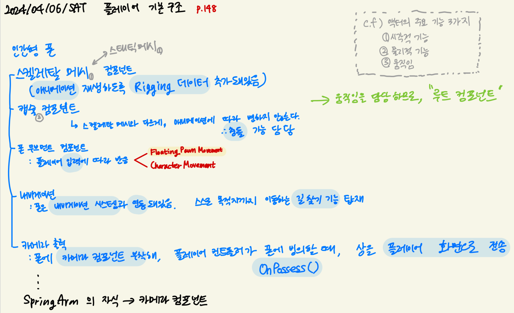
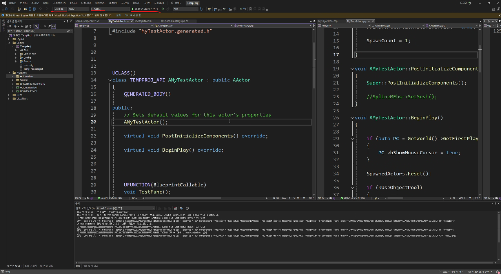
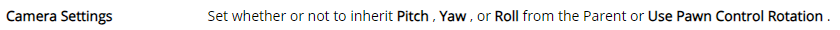
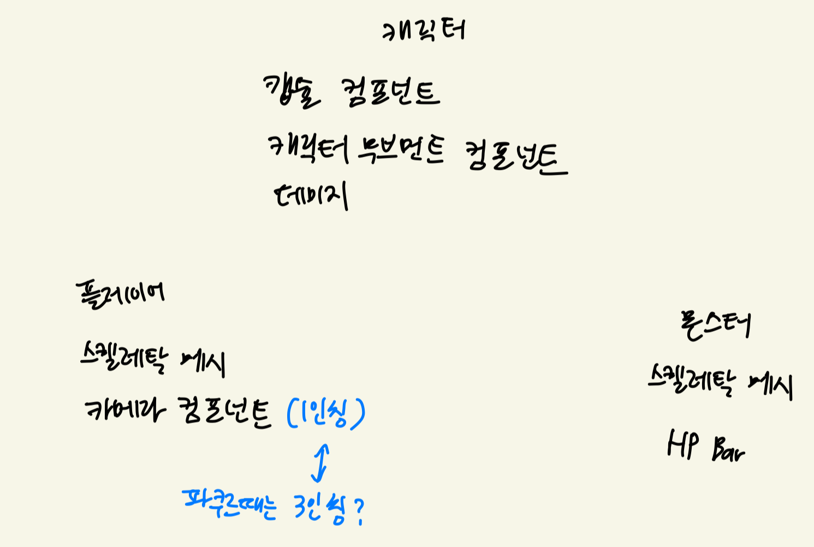

# Ch2. 액터의 설계

### 주요 컴포넌트

- 스태틱메시 컴포넌트: **애니메이션이 없는** 모델링 애셋인 스태틱메시를 사용해, **시각적인 기능**과 **물리적인 기능**을 제공
- 스켈레탈메시 컴포넌트: 애니메이션 정보가 있는 모델링 애셋인 스켈레탈 메시를 사용해, **시각적인 기능**, **애니메이션**, 캐릭터의 **물리 기능** 제공
- 콜리전 컴포넌트: 구/박스/캡슐로 지정한 영역에 **물리적인 기능 설정 모듈**. 시각적 기능 X
- 카메라 컴포넌트: 플레이어의 모니터 **화면에 출력**해주는 기능
- 오디오 컴포넌트: 소리를 발생시키는 기능
- 파티클 시스템 컴포넌트: 파티클 시스템으로 설계된 **이펙트를 화면에 띄움**.
- 라이트 컴포넌트: 전구, 헤드라이트 등과 같이 **물체에 광원효과를 부여**하는 기능
- 무브먼트 컴포넌트: 물체에 특정한 **움직임 부여 기능**

# Ch3. 움직이는 액터의 제작

### 무브먼트 컴포넌트 종류

- `FloatingPawnMovement`: **중력의 영향 X** 액터의 움직임. **입력에 따라** 자유롭게 움직임.
- `RotatingMovement`: **지정한 속도**로 액터를 **회전**시킴.
- `InterpMovement`: **지정한 위치로** 액터를 **이동**시킴.
- `ProjectileMovement`: 액터에 **중력**의 영향을 받아 포물선을 그리는 **발사체**의 움직임 제공.

# Ch4. 게임플레이 프레임워크

### 게임모드를 코딩할 때, default pawn을 설정할 때 StaticClass를 사용하는 이유

- 폰 액터를 생성해서, 미리 생성해둔 폰 액터로 설정하지 않는 이유
- 멀티플레이어 환경까지 고려했을 때, 몇 명이 들어올 지 모르기 때문에 액터 생성 개수를 예측할 수 없다.
- 따라서 **클래스 정보만 저장**해두고, 플레이어가 입장할 때마다 클래스 정보를 기반으로 **폰을 생성**하는 것.
- **언리얼 오브젝트**의 **클래스 정보**는 **언리얼 헤더 툴**에 의해 자동으로 생성되고, `StaticClass()` static함수를 통해 접근할 수 있다.

### 클래스 멤버 함수 선언 시 주의점

- C++은 접근 제한자를 따로 설정하지 않으면 클래스는 자동으로 private , 구조체 안에서는 자동으로 public 으로 선언된다.
    
    
    
    기여: 대성님
    
- 따라서 명시적으로 접근 제한자를 적는 습관이 중요하다.

### 플레이어 컨트롤러와 폰의 차이

- 둘 다 **플레이어가 입장**하면, **게임모드**가 액터를 **생성**해서 **배정**한다.
- `플레이어 컨트롤러`는 **두뇌**이고, **배정된 플레이어 컨트롤러는 변경할 수 없다**.
- `폰`은 `플레이어 컨트롤러`에 조종당하는 액터이다.

### 언리얼 에디터의 플레이 버튼을 누른 후, 플레이어 입장 과정

1. 플레이어 컨트롤러 생성
2. 플레이어 폰의 생성
3. 플레이어 컨트롤러가 플레이어 폰을 빙의
4. 게임의 시작

### 함수 호출 위치

- 플레이어 입장(로그인): 게임모드의 `PostLogin()` 이벤트 함수
- 플레이어 컨트롤러 생성, 폰 생성: 각 액터의 `PostInitializeComponents()`
- 빙의 진행 시점: 플레이어 컨트롤러의 `Possess()`, 폰의 `PossessedBy()`
- 실험 결과
    
    
    
    - 로그 중 일부
        
        ```
        
        ArenaBattle: Warning: AABPlayerController::PostInitializeComponents(10)
        ArenaBattle: Warning: AABGameModeBase::PostLogin(23) PostLogin Begin
        ArenaBattle: Warning: AABPawn::PostInitializeComponents(32)
        ArenaBattle: Warning: AABPlayerController::OnPossess(15)
        ArenaBattle: Warning: AABPawn::PossessedBy(37)
        ArenaBattle: Warning: AABGameModeBase::PostLogin(25) PostLogin End
        ```
        

# Ch5. 폰의 제작과 조작

### 폰의 구성 요소



- 캐릭터는 폰에서 인간형 캐릭터를 위한 확장 버전
- 따라서 캐릭터는 캡슐, 메쉬, 무브먼트가 기본으로 구현돼있다.
- 예를 들어 MyCharacter 폰을 상속받았을 때 똑같이 캐릭터처럼 구현하면 똑같이 동작한다.
    - 캐릭터를 사용하는 다른 곳에서, MyCharacter는 호환이 안될 수 있다
- 함수 이름만 보고 감만 잡고, 필요한 기능만 사용하고…

[언리얼 엔진 소스를 직접 빌드해 내 프로젝트에서 사용하기 - 참고링크](https://www.notion.so/850c9b72805b4913b75bb3715cc571d4?pvs=21)

- 이거는 언리얼 엔진 소스를 편집해서 사용해야할 경우가 있을 때 위의 방법을 실행하면 된다.
- 에픽게임즈 런처에서도 기본적으로 `디버깅을 위한 편집 기호` 옵션을 통해 엔진 소스코드를 read 할 수 있다.



- 기본적으로 1번 Develop으로 되어있는데, **DebugGame Editor**으로 설정하고, 2번 내 프로젝트 맞는지 확인하고, 3번 **디버거**로 키기
    - 이거 각각 옵션 마다 차이점을 아는 게 좋긴 하다. (중요한 건 아님)
- 중단점을 찍어서 여기가 돌아가는 지 알고 싶어! 값을 보고 싶어! 로그를 안찍어도 되는 장점 → 구현할 때 훨씬 편함. 빠름.

# Ch6. 캐릭터의 제작과 컨트롤

- `PlayerController` : 플레이어와 1:1로 매칭돼 플레이어의 의지를 전달하는 PlayerController는 주로 ~~게임 세계의 물리적인 요소~~를 고려하지 않은, **플레이어의 의지에 관련된 데이터**를 관리.
- `Pawn` : 게임 세계에서 **물리적인 제약**을 가지기 때문에, **현재 캐릭터가 처한 물리적인 상황** 관리.
    
- 카메라 지지대 속성 별 의미
    
    ```cpp
    SpringArm->TargetArmLength = 450.0f;
    SpringArm->SetRelativeRotation(FRotator::ZeroRotator);
    SpringArm->bUsePawnControlRotation = true;
    SpringArm->bInheritPitch = true;
    SpringArm->bInheritRoll = true;
    SpringArm->bInheritYaw = true;
    SpringArm->bDoCollisionTest = true;
    bUseControllerRotationYaw = false;
    ```
    
    - `bUsePawnControlRotation` : 캐릭터가 회전함에 따라 똑같이 회전
    - `bInheritPitch`, `bInheritRoll`, `bInheritYaw` : `bUsePawnControlRotation` 이 false라면 부모의 회전값을 상속받기. `bUsePawnControlRotation` 이 true라면 `bUsePawnControlRotation` 의 회전값을 상속받기. `bUsePawnControlRotation` true일 때 Pitch, Roll, Yaw도 true여야 정상적으로 작동한다.
        
        
        
    - `bDoCollisionTest` : 카메라가 벽과 충돌했을 때, 자연스럽게 앞으로 zoom 할지, 그냥 냅둘지
    즉 충돌 처리
    - `bUseControllerRotationYaw` : 플레이어 컨트롤러의 입력에 따라 캐릭터도 회전한다면 (true)

### 카메라 회전 관련 참고 링크

[https://velog.io/@starkshn/Pitch-Yaw-Roll-3인칭](https://velog.io/@starkshn/Pitch-Yaw-Roll-3%EC%9D%B8%EC%B9%AD)

https://leekangw.github.io/posts/27/

### 개인 프로젝트 적용 계획



### 1인칭 카메라 방법

- spring arm을 따로 두지 않고, 카메라만을 머리 위치에 두면 된다.
    - 마우스의 회전에 따라 컨트롤러도 움직이게끔 한다.
    - 컨트롤러의 조작에 따른 Pawn의 움직임 옵션을 기본값인 true로 설정한다.
        
        ```cpp
        bUseControllerRotationPitch = true;
        bUseControllerRotationRoll = true;
        bUseControllerRotationYaw = true;
        ```
        
    - 카메라 컴포넌트의 PawnControlRotation 옵션을 킨다.
        
        ```cpp
        FirstPersonCameraComponent->bUsePawnControlRotation = true;
        ```
        
- 보통 1인칭 게임에서는 머리를 없애고 카메라만을 배치하고, 멀티 플레이에서는 머리를 장착한다.
- 개인 프로젝트에서도 1인칭 ↔ 3인칭 전환 시 머리를 On/Off 하는 방식으로 구현하고자 한다.

### 기타 개발 팁

변경이 잦을 때: BP로 객체 참조 하다가 (실무에서는 BP를 활용한다. 언제든지 경로 오류가 생길 수 있기 때문에)
최종 확정 후: Constructor 레퍼런스 참조로

### 앞으로의 계획

슈팅 관련 참고 링크

https://kwonriver.tistory.com/91